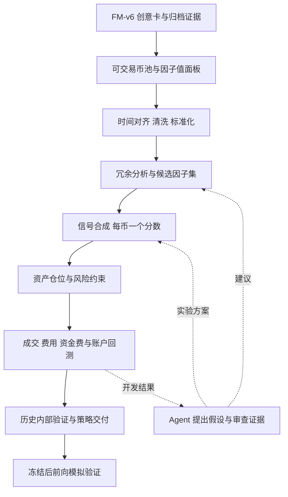

# 多因子策略研究系统构建讨论稿

日期：2026 年 10 月 2 日。用途：承接与 Gemini 的讨论，供后续与 Pro 深入确定系统方案。

**建议主线：以现有 FM-v6 创意卡为候选因子库，在策略研究层建立从因子面板、冗余分析、信号合成到仓位、含成本回测和前向验证的闭环。确定性程序负责计算与执行，Agent 负责组合假设、证据审查和实验建议。先建立简单基线，再验证正交化、动态权重和 Agent 是否提供增量。**

本文区分已经核实的项目能力、Gemini 提出的方向和本稿的构建建议。尚待确定的参数与功能，不视为已经作出的实施决定。

## 一 这次讨论真正要解决的问题

2026 年 10 月 2 日上午，在 Antigravity 的《V6因子挖掘与创意卡》中，讨论从“创意卡还能增加什么”转向了“下游多因子策略研究系统应该怎么建”。其中几条用户原话明确了关注点：

> “我们下面的策略研究，是不是得写一个以多因子策略为主的系统，这个系统里面有必要用agent吗”

> “实际上我们之前的创意卡就是因子库……在因子共线性剔除与正交化这里我们可以加一个agent，多因子权重这里可以加agent吗，还是用传统的算法。”

> “对称正交化是把多个合成成一个吗？……因子的共线性剔除与正交化，还有一个多因子权重合成，这两个……详细的流程是怎样的呢？”

因此，下次讨论应围绕以下问题展开：怎样把现有因子研究线索转换成可验证的交易策略；哪些步骤直接使用传统算法；Agent 在哪里能够改善研究判断；如何证明改善来自真实增量。

Gemini 给出的主要方向是“Agent 研究层＋确定性量化底座”，并建议先建立最小计算闭环。这条方向可以保留。它关于“多因子必须改善收益”“正交后因子完全独立”“Agent 必不可少”的说法，需要改为待验证的假设。

## 二 项目现在的起点

以下是对当前工作目录源码、示例合同和项目文档的核查结果。

| 已有基础 | 对新系统的意义 | 需要补齐的部分 |
| --- | --- | --- |
| FM-v6 创意卡包含公式、预设方向、经济机制假说、通过与保留期限、覆盖情况、证伪条件及证据引用 | 可以作为候选因子目录和研究证据入口 | 卡片本身不等于完整因子值面板；须核对归档或重算结果与卡片的一致性 |
| 当前示例合同包含 1h、4h、24h 多期限、批次内 BH 校正、有向 IC 下限 0.01 和正分组价差要求 | 已有单因子研究筛选流程 | 上游统计准入不能替代下游含成本策略检验；旧运行按原合同解释 |
| `strategy_research` 已有设计、计算语义核对、回测、评估与修改流程 | 可以在现有路线中扩展，避免重新搭一套研究调度框架 | 本次关注的多因子面板、冗余比较和标准化合成流程仍须明确适配 |
| `factor_rule_spot` 支持多个命名信号、评分、入场退出及仓位规则 | 已有多信号组合的工程基础 | 该路线当前是 BTC/ETH 现货多头或现金，字段及仓位数量有限；不能直接承接全部 USD-M 因子卡 |
| 另有现货永续基差路线和其他回测、执行模块 | 存在可核查的复用对象 | 不据此推定多币种永续多空、保证金和资金费账本已经满足新路线要求 |

当前创意卡输出明确保存 `status=research_idea` 和 `strategy_validation_status=not_started`。卡片记录的是候选关系及其研究证据，下游仍需定义选币、仓位、调仓、成交、费用和风险规则。

**市场建议：以与因子库一致的 Binance USD-M 永续、多币种横截面为目标路线。** 现有 BTC/ETH 现货路线可以帮助核查研究流程，但不能拿两币现货回放代替目标路线验收。第一步应先确认本地币池、数据和执行账本能支持哪一种最小组合。

本节核查依据：[因子示例合同](../../examples/factor_mining/research.contract.json)、[创意卡生成代码](../../src/crypto_quant/research/factor_mining/workflow.py)、[策略引擎](../../src/crypto_quant/research/strategy_research/engine.py)、[现货信号规则](../../src/crypto_quant/research/strategy_research/rule_strategy.py)。

## 三 完整系统应该怎样连接

下面是建议的职责划分。它描述目标流程，不表示所有模块都已实现。



| 环节 | 主要输入与处理 | 应保存的输出 |
| --- | --- | --- |
| 候选读取 | 核对卡片、公式、方向、期限、市场和数据能力 | 本次选卡清单、版本、来源与排除理由 |
| 因子面板 | 按时点和资产计算各因子，处理预热、缺失、上市退市和可交易资格 | 每个时点的资产×因子矩阵、有效掩码和覆盖记录 |
| 预处理 | 截面去极值、标准化；有具体风险目标时再做中性化 | 变换参数、处理后面板和样本变化 |
| 冗余分析 | 比较公式谱系、相关性、子策略收益和组合增量 | 保留或剔除清单、依据及对照实验 |
| 信号合成 | 等权、ICIR、回归或其他模型 | 每个资产的分数、合成参数和更新时间 |
| 仓位生成 | 把分数映射成多空或多头仓位，施加敞口和换手限制 | 目标仓位、约束是否满足及调仓原因 |
| 回测验证 | 按真实时间顺序成交和记账，比较基线与成本压力 | 订单、成交、持仓、账本、净值和风险报告 |

有两个区别必须先讲清楚：

1. **Alpha 因子与风险因子。** Alpha 因子用于预测相对收益；风险因子用于描述市场、Beta、波动率等共同暴露。同一个变量可能同时扮演两种角色，但预测模型和风险模型需要分别定义。
2. **因子权重与资产权重。** 因子权重决定多个信号怎样合成；资产权重决定账户买卖哪些币、投入多少资金。它们对应不同维度。Qlib 也将预测分数与基于分数生成投资组合的策略区分开。[Qlib 官方策略文档](https://github.com/microsoft/qlib/blob/main/docs/component/strategy.rst)

## 四 共线性剔除和对称正交化怎样做

### 先分析冗余 再决定是否变换

建议采用以下顺序：

1. **统一比较条件。** 因子使用一致的资产、时间、有效样本和方向口径。不能把一个 1h 因子的短期限结果与另一个 24h 因子的长期限结果直接排名。
2. **检查公式和谱系。** 识别窗口、平滑、门控等变体。机制标签可以辅助分组，但标签来自假说，不能单凭名称证明互补。
3. **计算数值相关性。** 分别查看各时点截面相关、过去窗口的相关分布及阶段变化；注明 Pearson 或 Spearman。强负相关也可能代表重复信息。
4. **检查组合增量。** 除因子值相关外，比较按相同规则形成的子策略收益、风险暴露与换手；在开发窗口内做加入或移除该因子的对照。
5. **选择处理办法。** 同族中选代表、按家族限制权重、保留相关特征交给 Ridge，或做正交化。具体阈值和选择规则在正式比较前确定。

Gemini 举出的相关系数 0.7、0.8 等数值只能作为候选设置。高相关未必值得删，低相关也未必有预测增量。机制不同的因子是否都保留，应同时看数值证据和含成本组合表现。

### 对称正交化的输入和输出

假设同一时点有 N 个币、M 个经过中心化的因子，矩阵 X 的形状是 N×M。采用分母 N 的协方差定义：

```text
S = XᵀX / N
S = UΛUᵀ
W = S^(-1/2) = UΛ^(-1/2)Uᵀ
Z = XW
ZᵀZ / N = I
```

在 S 正定时，输入和输出都保留 M 列。每一列新因子通常混合了多个原始因子，变换消除了当前估计样本中的线性协方差。

**例如：** 两个标准化因子的相关系数为 0.8，则对应的对称变换近似为：

```text
F1新 = 1.491 × F1 − 0.745 × F2
F2新 = −0.745 × F1 + 1.491 × F2
```

它仍产生两个变量；随后才用权重合成为一个分数。这个例子也说明，变换后的“F1新”已经包含 F2，原来的经济标签不能原封不动地套上去。

这种协方差白化对应对称的 ZCA 思路；在相应度量下可以尽量接近原变量，但“接近”不等于保留全部经济含义。[Optimal whitening and decorrelation](https://arxiv.org/abs/1512.00809)

### 工程上必须确定的条件

- **零相关不等于统计独立。** 非线性依赖、共同尾部风险和资产市场暴露仍可能存在。
- **严格白化需要足够的矩阵秩。** 中心化后秩至多为 N−1；币数很少、因子过多或存在完全重复列时，不能保证得到 M 个单位方差、两两正交的变量。
- **很小的特征值会放大噪声。** 若采用去重、降维或协方差收缩，要明确方法。对收缩后的协方差做白化，一般不会使原经验协方差严格等于 I。
- **估计范围必须固定。** 使用当前可见截面或过去窗口都可能成立，但不得使用未来样本。滚动模型尤其需要声明变换更新时间、历史特征口径与预测时的应用方式。
- **变换后重新评估。** 原卡的方向和 IC 描述原因子；正交后的变量须重新检查预测能力，并保存变换矩阵用于回看原始暴露。

**本稿建议：第一版先做谱系与数值冗余分析，建立不正交化的等权基线。正交化作为比较分支，只有表现和数值稳定性支持时才加入主流程。** Ridge 的正则项本身可以提高对共线性的稳健性，不要求先正交化。[scikit-learn Ridge 官方说明](https://scikit-learn.org/stable/modules/linear_model.html#ridge-regression-and-classification)

## 五 多因子权重合成怎样做

对保留的 M 个因子，先统一方向和尺度。记处理后的面板为 Z，则线性合成为：

```text
score[i,t] = Σ a[j,t] × Z[i,j,t]
```

这里 a 是因子权重，score 是每个币的综合分数。若没有正交化，Z 就是标准化后的原因子；若有正交化，a 对应变换后的变量。后者还要通过 W×a 回看它在原始因子空间中的系数。

### 建议按三个层次比较

| 方法 | 详细处理 | 本项目中的位置 |
| --- | --- | --- |
| 等权 | 方向和尺度统一后，各因子权重为 1/M；同族变体先选代表或按家族分配权重 | 第一条基线，回答组合是否比单因子更有用 |
| 滚动 ICIR | 仅用已经实现的未来收益标签计算过去 IC 序列，以均值和波动形成权重；提前确定窗口、负值处理、集中度和更新时间 | 第一条动态权重对照，检验历史表现能否改善下一阶段表现 |
| 滚动 Ridge | 使用过去时间×资产的因子和已实现收益拟合，控制正则强度、训练窗口与重训频率，再预测下一时点 | 后续模型基线，与等权和 ICIR 在同一交易规则下比较 |

等权减少了估计权重的复杂度，但选哪些因子、用什么方向、采用哪些窗口，仍可能形成选择偏差。ICIR 也不是“越大越安全”：短窗口、很小的标准差和相关因子的重复计权都可能造成集中。

**标签可用时间要落实到训练数据。** 若目标是未来 H 小时收益，时点 t 更新模型时，只能使用标签区间已经结束且收益已可知的样本。不能把刚刚开始的 24h 标签加入当下训练。开发期内按时间滚动比较，边界剔除跨窗标签；不能随机打散币×时间样本来模拟交易验证。

1h、4h、24h 是预测标签期限，不直接决定调仓周期。第一版建议选定一个目标期限和一套调仓规则，避免把三个期限随意混成同一目标。后续若做多期限组合，要分别定义预测或子策略及资本分配。

LightGBM 等非线性模型学习的是收益或排序映射，通常没有一个固定全局因子权重向量。它们可以放入后续比较，但样本是否足够不能只看币数，也要看时间长度、依赖结构、市场阶段和搜索次数。

## 六 综合分数怎样变成策略

合成得分以后，还需明确交易规则。建议首版选择一种容易核对的横截面排序组合：固定多空名额或分组，组内等权，固定调仓周期，声明总敞口、净敞口和单币上限。若首版选择多头加现金，也要明确市场方向暴露和比较基准。

这层必须回答：何时允许开仓或退出；持仓不足怎样处理；是否允许空仓、做空和杠杆；未到调仓点是否持仓；分数相同如何排序；当时不可交易的币怎样处理。规则应在研究合同中确定。

永续组合回测需要至少核查：

1. 收盘信息何时可用、下一次成交用哪种价格，信号、订单和成交时间怎样连接。
2. 每次成交手续费与滑点、持仓对应的资金费现金流、标记价格估值和保证金需求。
3. 单币集中度、总净敞口、波动与尾部风险、流动性限制，以及无法支持的清算或强平细节。
4. 净收益、回撤、换手、成本、阶段表现、持仓集中度和收益来源；在同一规则下比较单因子与组合。

排序分数没有预期收益单位，不能未经校准直接当作优化器中的收益 α。后续若引入“收益减风险和交易成本”的优化目标，须同时规定收益估计、资产收益协方差及成本单位。这里需要的是资产收益风险模型，不能用因子值相关矩阵直接替代。

Gemini 提到的固定 4～15 bps 或 10 bps，不作为本项目默认成本。应依据具体交易标的、账户费率假设、成交方式和规模确定，并与资金费分开记账。

## 七 Agent 应放在哪里

**Agent 最有价值的角色是提出可检验的组合方案、解释证据和发现研究漏洞。数值计算、约束检查和资格判定仍由明确程序完成。**

| 接入点 | Agent 读取什么 | 产出什么 | 如何检查它有没有用 |
| --- | --- | --- | --- |
| 因子谱系审查 | 创意卡、公式变体、相关性、覆盖与增量对照 | 同源或互补假说、建议保留或移除的对象、需要补做的实验 | 与纯相关过滤相比，是否减少误删、降低冗余并改善后续组合 |
| 组合实验设计 | 可执行能力、样本结构、开发证据和研究预算 | 有限的选卡、合成方法及参数比较方案 | 在相同数据和尝试预算下，是否优于固定研究流程 |
| 结果审查 | 账本、净值、成本、集中度、阶段与消融结果 | 具体风险、反证问题、继续或停止的建议 | 是否找出可复现的问题，而非只解释好看的回测 |

第一版可以把这些职责嵌入已有设计、评估、决策角色，不必新增多个常驻 Agent。每条结论应引用具体结果，保留原始输出和实际采用的方案。

Gemini 建议 Agent 根据市场状态动态切换合成方法或限制某类权重。本稿建议将其留到后续：它本身就是一条新策略，需要定义当时可得的输入、状态判断、调用时点、模型与提示词版本、完整输出及约束范围，并做前向记录。事后根据已知历史叙事补写状态，不能还原当时的决策。

直接输出权重的 Agent 可以在保存输入、输出和调用时序后接受测试；问题在于是否有可验证依据、能否稳定满足约束、是否胜过算法基线。不能简单用“无法回测”否定，也不能用解释听起来合理就接受。

**加入 Agent 并不会自动控制过拟合。** 它生成和比较的每个新方案都属于研究尝试。固定预算、记录全部尝试、时间边界和前向检验，仍是验证的一部分。

## 八 实施顺序与完成标准

以下是本稿建议的阶段，不是本次已授权启动的代码改造。

| 阶段 | 要完成的工作 | 可核查的完成标准 |
| --- | --- | --- |
| 1 确定能力和合同 | 选定市场、币池、少量可核对因子、目标期限和一种交易规则；检查数据与账本 | 每个输入、成交时点、仓位、费用及验证用途明确，缺能力有清单 |
| 2 跑通传统最小闭环 | 读卡或重算因子、预处理、冗余分析、等权合成、排序仓位、含成本回测 | 因子值可回溯，手算样例与成交账本一致，完整链路可重跑 |
| 3 比较方法增量 | 在有限预算内比较不去重与去重、等权与 ICIR；再按需要加入 Ridge 或正交化 | 对照共享样本和交易规则，保留失败与无增量结果 |
| 4 接入 Agent 审查 | 在已有角色中提供结构化证据，记录其建议与实际处理 | 能指出具体实验或缺陷；与固定流程进行同预算比较 |
| 5 冻结和前向验证 | 固定因子、训练更新规则、仓位、风险、成本及观察标准 | 启动后记录新行情与完整账户；变更策略另存版本和测试起点 |

需要区分三种完成：计算与账本正确，是工程完成；在明确历史用途下获得组合改善，是历史研究结果；冻结后在新产生数据上观察，是前向验证。收益未改善也可以形成完整、有效的研究结论。

### 本项目的数据边界

项目当前约定：策略开发使用 A＋B，即 UTC `[2022-08-01, 2025-08-01)`；原 C `[2025-08-01, 2026-08-01)` 用于策略内部验证。C 已有暴露，不能再作为未接触的最终测试集。最终测试路线是冻结策略后新产生行情的模拟账户观察。

本地主要数据库还存在事后插值和边界补值记录。这些值不能自动视为历史时点真实可得。正式策略证据需要核查原始或因果可用数据、修复掩码及样本影响；在问题解决前，相关结果标明其工程或探索用途。

上述约定来自[研究数据使用规范](../data/研究数据划分与使用规范.md)和[当前数据策略代码](../../src/crypto_quant/research/data_policy.py)。新系统不因更换模型、任务名称或重新切分日期，就恢复旧样本的独立性。

## 九 希望 Pro 重点讨论的问题

1. **目标路线：** 多币种 USD-M 永续是合理首版吗？在现有数据与回测能力下，哪种最小多空或多头组合最容易核查？
2. **因子冗余：** 相关性应怎样跨时点汇总？公式谱系、子策略收益和边际预测增量各自发挥什么作用？
3. **正交化：** 本项目是否有实际需要？与家族权重约束、去重后等权、直接 Ridge 相比，它要解决哪个已知问题？
4. **估计稳定性：** 币数有限和因子高度相关时，变换矩阵怎样估计和更新？何时应停止、降维或采用明确的收缩方法？
5. **权重与期限：** 首版选哪个预测目标和调仓规则？ICIR 与 Ridge 的窗口、标签成熟和重训规则怎样定义？多期限如何组合？
6. **Agent 的价值：** 优先加入谱系审查还是组合实验设计？怎样通过同预算实验验证增量，避免仅增加解释文本？
7. **正式证据：** 已暴露的历史样本和事后插值条件下，哪些结论仍能支持，哪些必须等待冻结后的前向验证？
8. **最小改造范围：** 哪些能力可以复用，哪些永续执行与账户规则必须新增？首版合同和验收应保留哪些项目？

### 可以直接附给 Pro 的开场提示

> 我在构建加密资产量化研究平台。上游 FM-v6 已产出带公式、方向、多期限统计、经济机制假说和归档证据的因子创意卡；现在要设计以多因子策略为主的下游研究系统。请根据本文讨论具体方案，先核查技术判断，再确定最小可实现闭环。
>
> 请重点解释共线性剔除、对称正交化、信号合成和资产仓位之间的关系；比较去重后等权、ICIR、Ridge 和正交化的适用条件。请判断 Agent 在谱系审查和实验设计中的可验证价值，给出输入、输出与比较方法。
>
> 已知约束：目标因子来自 Binance USD-M 永续的多币种小时数据；现有策略研究已有部分多信号现货和基差能力，但目标路线适配还要核查。历史 C 已被使用，数据库有事后插值记录，最终验证走冻结后的前向模拟。请区分工程回放、历史研究和前向证据，不把论文收益或单因子准入直接当作本系统的验证。
>
> 请先回答第九节的问题，并输出首版架构、必要合同、执行缺口和验收标准。文中项目路径是核查依据；如需查看源码，请明确列出所需文件，不假设你已访问它们。先讨论方案，不直接开始改代码。

## 十 外部参考与需要修正的说法

外部项目用于比较架构和职责，具体功能及表现不自动适用于本项目。

- **RD-Agent：** 官方论文描述了研究假说、开发执行和反馈连接的因子与模型联合优化，可参考其实验循环。Gemini 提到的“约两倍年化收益、少七成因子”有论文来源，但属于其具体股票实验，不是本项目效果预期。[论文](https://arxiv.org/abs/2505.15155)、[官方仓库](https://github.com/microsoft/RD-Agent)
- **Qlib：** 可参考预测分数、组合策略、执行和分析的职责划分。本项目是否复用代码，需要先核查数据和成交语义。[官方策略文档](https://github.com/microsoft/qlib/blob/main/docs/component/strategy.rst)
- **TradingAgents：** 官方仓库是 `TauricResearch/TradingAgents`。其分析师、研究辩论和交易角色可供职责设计参考；本稿不据此采用辩论后直接确定组合权重的流程。[官方仓库](https://github.com/TauricResearch/TradingAgents)
- **OpenFactor：** 主要是股票风险模型，提供暴露、协方差和归因工具；官方说明它不负责求解投资组合。应把它放在风险模型参考位置，区分 Alpha 合成。[官方仓库](https://github.com/ralliesai/openfactor)

| Gemini 的说法 | 本稿采用的判断 |
| --- | --- |
| 多因子和 Agent 都必须使用 | 多因子是值得验证的主线；Agent 是否改善研究，由对照结果决定 |
| 正交后完全独立并保留原始经济含义 | 在条件满足时消除样本线性协方差；变量通常混合原始信息，不保证独立或经济含义不变 |
| S=XᵀX/N 时，ZᵀZ=I | 对应关系应为 ZᵀZ/N=I |
| 等权完全没有过拟合风险 | 权重估计简单，但因子、参数与方案选择仍有过拟合风险 |
| 正交后 Ridge 权重一定稳健 | Ridge 不必先正交化；稳定性仍受样本、变换、正则和市场变化影响 |
| 零相关因子会带来新的 Alpha，多因子 IC 可以直接相加 | 增量预测与净收益须实测；IC 的分母及相关结构会随合成变化 |
| 单因子 IC 可以直接推导夏普和最优调仓 | 还取决于信号分布、资产风险、交易规则、换手和成本，不能作固定换算 |

本稿聊天依据为 2026 年 10 月 2 日 9:49 至 10:18 的相关讨论，读取了 Antigravity 当前回复与近期 Computer History 记录。项目依据为同日工作目录的文件状态；本文不声称目标系统已经实现或通过完整验证。
